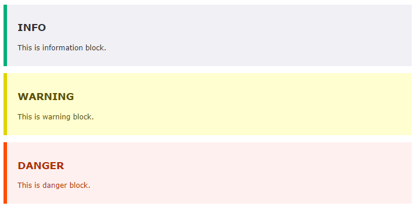

# Redmine Callout Macro Plugin

This plugin adds Callouts(Hints, Custom Containers) to wiki formated fields. 

## Example

```
{{info(INFO)
This is information block.
}}
{{warning(WARNING)
This is warning block.
}}
{{danger(DANGER)
This is danger block.
}}
```



## Installation

1. Clone or copy files into the Redmine plugins directory
   ```
   git clone https://github.com/taikii/redmine_callout_macro.git plugins/redmine_callout_macro
   ```
2. Restart Redmine

## License

[MIT](LICENSE)
